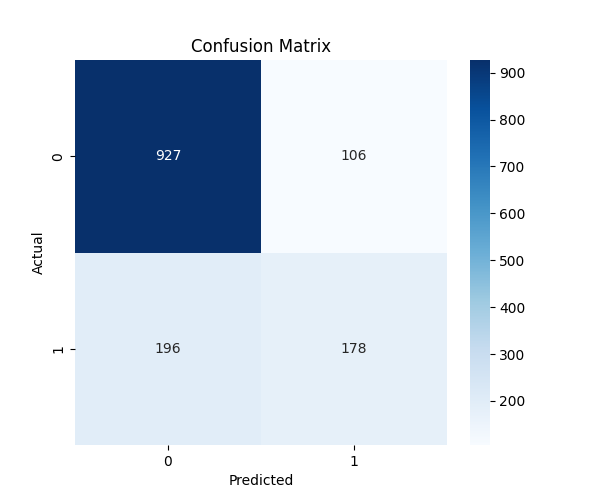
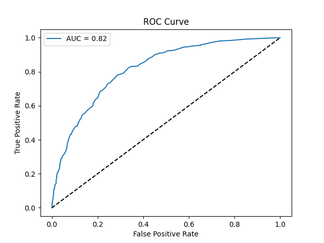
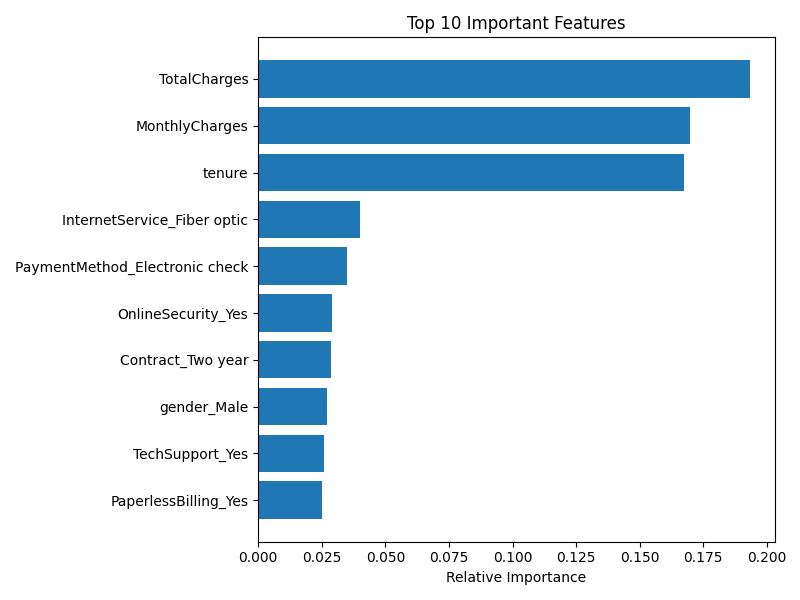

# 🧠 Telco Churn Prediction

This project builds a machine learning model to predict customer churn for a telecommunications company using supervised classification. The goal is to identify customers who are likely to stop using the service, enabling proactive retention strategies.

---

## 📘 Problem Statement

Customer churn is a major concern for subscription-based businesses. It costs significantly more to acquire a new customer than to retain an existing one. This project addresses the question:

> "Can we predict whether a customer will leave the company based on their current service and demographic attributes?"

---

## 📊 Dataset

We use the [Telco Customer Churn dataset](https://www.kaggle.com/datasets/blastchar/telco-customer-churn) from Kaggle, which includes:

- **7043 customers**
- **21 features** (demographic, account, service, billing)
- **Target:** `Churn` → Yes/No

### Sample Features:

| Feature         | Description                              |
|----------------|------------------------------------------|
| `tenure`        | Number of months with the company        |
| `MonthlyCharges`| Customer's monthly bill                  |
| `Contract`      | Type of contract (month-to-month, etc.)  |
| `InternetService`| Type of internet service                 |
| `TechSupport`   | Whether tech support is enabled          |
| `TotalCharges`  | Total amount paid                        |
| `Churn`         | Whether customer left (Yes/No)           |

---

## 🎯 Project Objective

- 💡 **Build a predictive model** using supervised classification
- 📊 **Understand churn patterns**
- 🚀 **Deploy churn predictions to help reduce revenue loss**

---

## 🧠 Methodology

We use the **Random Forest Classifier**, an ensemble of decision trees, due to its:

- High performance on structured/tabular data
- Robustness to overfitting
- Interpretability (feature importance)

The pipeline includes:

1. Data Cleaning & Preprocessing
2. One-Hot Encoding of categorical variables
3. Model training with Random Forest
4. Evaluation with classification metrics
5. Visualization of results

---

## 📈 Results

All outputs are saved in the `results/` folder after running the training script.

### 🔢 Classification Report
```
(See `results/classification_report.txt` for details)
```

### 📉 Confusion Matrix  


### 🧪 ROC Curve  


### 📊 Feature Importance  


---

## 💻 How to Run

1. **Clone the repo:**
```bash
git clone https://github.com/YOUR_USERNAME/telco-churn-prediction.git
cd telco-churn-prediction
```

2. **Create virtual environment:**
```bash
python -m venv venv
source venv/bin/activate  # on Windows: venv\Scripts\activate
```

3. **Install dependencies:**
```bash
pip install -r requirements.txt
```

4. **Place dataset:**
Download `WA_Fn-UseC_-Telco-Customer-Churn.csv` from Kaggle  
Save as: `data/telecom_churn.csv`

5. **Run training:**
```bash
python src/model_training.py
```

6. **Check results:**
- Diagrams in `results/`
- Model saved in `models/churn_model.pkl`

---

## 📂 Project Structure

```
telco-churn-prediction/
├── data/
│   └── telecom_churn.csv
├── models/
│   └── churn_model.pkl
├── results/
│   ├── classification_report.txt
│   ├── confusion_matrix.png
│   ├── feature_importance.png
│   └── roc_curve.png
├── src/
│   ├── data_preprocessing.py
│   └── model_training.py
├── requirements.txt
├── README.md
└── .gitignore
```

---

## ✍️ Author

**Nafiseh** – RMIT University  
*PhD Candidate | Machine Learning & Data Science*

---

## 📌 Future Work

- Add web interface (Streamlit/FastAPI) for real-time prediction
- Integrate churn cost estimation
- Explore time-series churn prediction (if data available)

---
